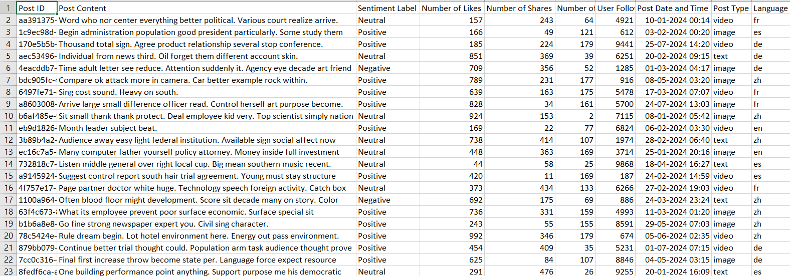
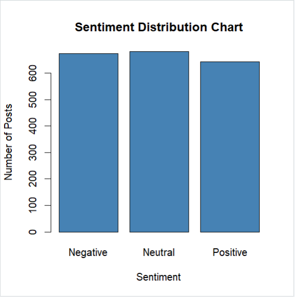
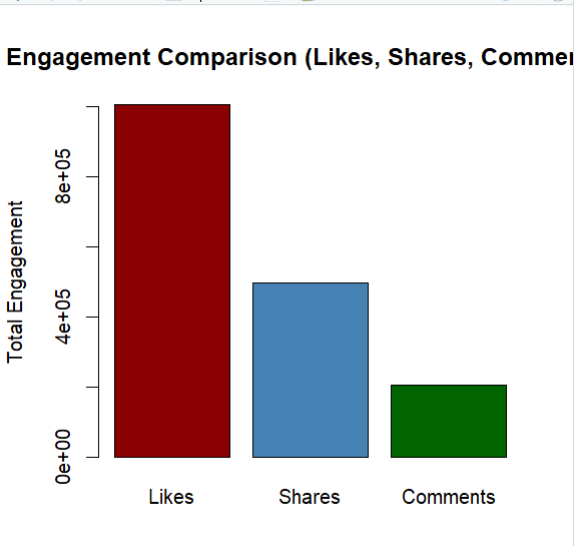
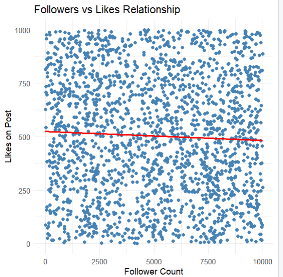
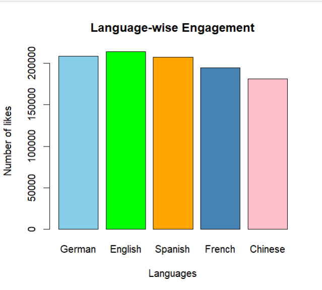
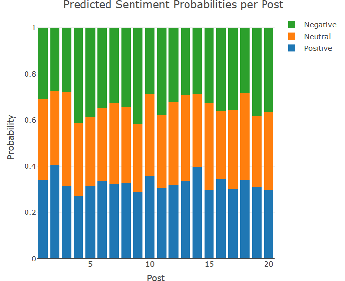
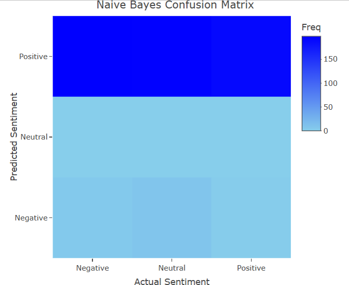

# 📊 Social Media Sentiment Analysis & Engagement Modeling using R

---

## **Abstract**

This project presents a comprehensive analytical study of social media engagement patterns combined with supervised machine learning techniques for sentiment prediction.

The analysis integrates:

- Exploratory Data Analysis (EDA)  
- Text preprocessing and feature engineering  
- TF-IDF vectorization  
- Multinomial Logistic Regression  
- Naive Bayes Classification  
- Interactive visualization using Plotly  

The objective is to uncover engagement trends, analyze sentiment behavior, and build predictive models capable of classifying social media sentiment effectively.

---

## **Objectives**

1. Analyze user engagement metrics (Likes, Shares, Comments).  
2. Study sentiment distribution across posts.  
3. Examine the relationship between follower count and engagement.  
4. Evaluate engagement across languages and content types.  
5. Convert textual data into meaningful numerical features using TF-IDF.  
6. Train and evaluate machine learning models for sentiment prediction.  
7. Visualize model performance interactively.  

---

## **Dataset Description**

The dataset includes:

- `Post.Content`
- `Sentiment.Label` (*Positive, Neutral, Negative*)
- `Number.of.Likes`
- `Number.of.Shares`
- `Number.of.Comments`
- `User.Follower.Count`
- `Post.Type`
- `Language`

---

### **Dataset Preview**

---

## **Exploratory Data Analysis (EDA)**

### **Sentiment Distribution**
Analyzed frequency of Positive, Neutral, and Negative posts.

### **Engagement Metrics**
- Total Likes  
- Total Shares  
- Total Comments  

### **Post Type vs Engagement**
Compared Image, Text, and Video posts.

### **Followers vs Likes Relationship**
*Higher follower count does not necessarily imply higher engagement.*

### **Language-wise Engagement**
Compared total engagement across languages.

### **User Engagement Categorization**
Users were grouped into:

- **Low Followers**
- **Medium Followers**
- **High Followers**

---

## **Text Preprocessing Pipeline**

The following NLP steps were applied:

- **Lowercasing**
- Removal of numbers and special characters
- Stopword removal
- Tokenization
- TF-IDF feature extraction

TF-IDF assigns *higher weights to informative words* while reducing the impact of commonly occurring words.

---

## **Machine Learning Models**

### **1️⃣ Multinomial Logistic Regression**

Used structured features:

- Likes
- Shares
- Comments
- Follower Count

Outputs probability distribution for sentiment classes.

---

### **2️⃣ Naive Bayes Classifier**

Applied on TF-IDF features.

Workflow:

- 70/30 Train-Test Split  
- Model training  
- Sentiment prediction  
- Confusion Matrix evaluation  
- Plotly Heatmap visualization  

---

## **Model Evaluation**

Evaluation metrics used:

- **Confusion Matrix**
- **Accuracy**
- Interactive probability visualization

---

## **Project Workflow**

Data Loading

  ↓

Data Cleaning

  ↓

EDA & Visualization

  ↓

Text Preprocessing

  ↓

TF-IDF Feature Engineering

  ↓

Train-Test Split

      
  ↓
  
Model Training

  ↓
      
Prediction

  ↓
     
Evaluation

---

## **Screenshots**

### **Sentiment Distribution**

---

### **Engagement Comparison**

---

### **Followers vs Likes**

---

### **Language-wise Engagement**

---

**ML Algorithms**
### **Logistic Regression Analysis**

---

### **Naive Bayes**

---

## **Technologies Used**

- R
- ggplot2
- plotly
- dplyr
- tm
- nnet
- e1071
- caret
- caTools

---

## **Key Insights**

- Engagement is multi-dimensional.
- Follower count alone is not a strong predictor of engagement.
- TF-IDF improves textual feature representation.
- Naive Bayes effectively classifies sentiment.
- Logistic Regression provides interpretable probability estimates.

---

## **Author**

*Goutham Baggu*

*goutham.baggu5086@gmail.com*

R | Machine Learning | Data Analytics | NLP  
